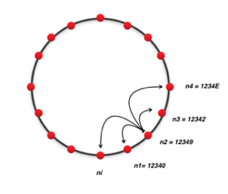

# py-swaplink

Chord DHT implemented in Python using Asyncio.

## DHTs
A distributed hash table (DHT) is a class of a decentralized distributed system that provides a lookup service similar to a hash table: (key, value) pairs are stored in a DHT, and any participating node can efficiently retrieve the value associated with a given key. Keys are unique identifiers which map to particular values, which in turn can be anything from addresses, to documents, to arbitrary data.

Responsibility for maintaining the mapping from keys to values is distributed among the nodes, in such a way that a change in the set of participants causes a minimal amount of disruption. This allows a DHT to scale to extremely large numbers of nodes and to handle continual node arrivals, departures, and failures. 
## Chord
Nodes and keys are assigned an *m-bit* identifier using consistent hashing. The SHA-1 algorithm is the base hashing function for consistent hashing. Consistent hashing is integral to the robustness and performance of Chord because both keys and nodes (in fact, their IP addresses) are uniformly distributed in the same identifier space with a negligible possibility of collision. Thus, it also allows nodes to join and leave the network without disruption. In the protocol, the term node is used to refer to both a node itself and its identifier (ID) without ambiguity. So is the term key.

Using the Chord lookup protocol, nodes and keys are arranged in an identifier circle that has at most 2m nodes, ranging from 0  to 2m-1. Some of these nodes will map to machines or keys while others (most) will be empty.

Each node has a successor and a predecessor. The successor to a node is the next node in the identifier circle in a clockwise direction. The predecessor is counter-clockwise. If there is a node for each possible ID, the successor of node 0 is node 1, and the predecessor of node 0 is node 2m−1; however, normally there are "holes" in the sequence. For example, the successor of node 153 may be node 167 (and nodes from 154 to 166 do not exist); in this case, the predecessor of node 167 will be node 153.

Since the successor (or predecessor) of a node may disappear from the network (because of failure or departure), each node records a whole segment of the circle adjacent to it, i.e., the *r* nodes preceding it and the *r* nodes following it. This list results in a high probability that a node is able to correctly locate its successor or predecessor, even if the network in question suffers from a high failure rate. 
